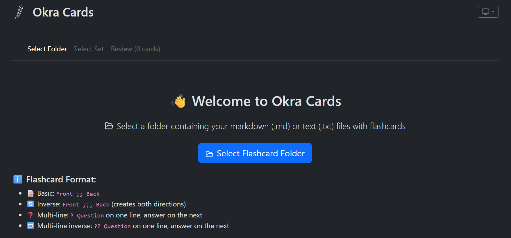
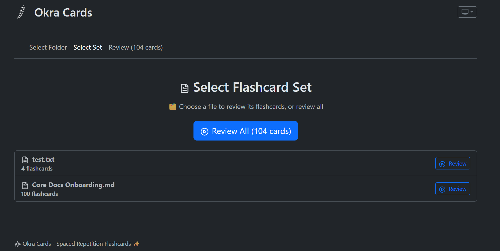
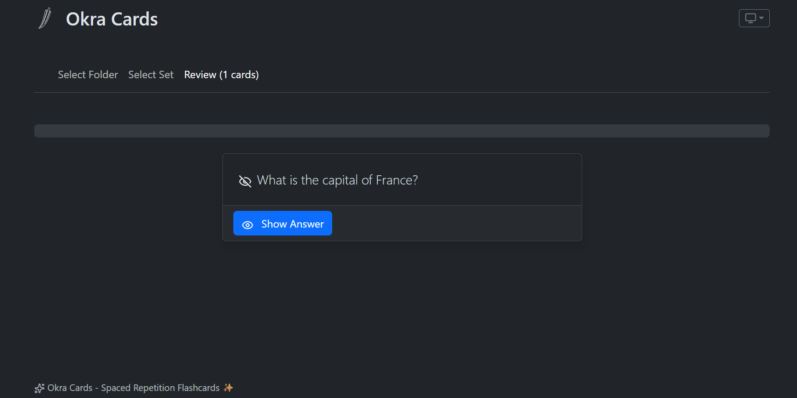
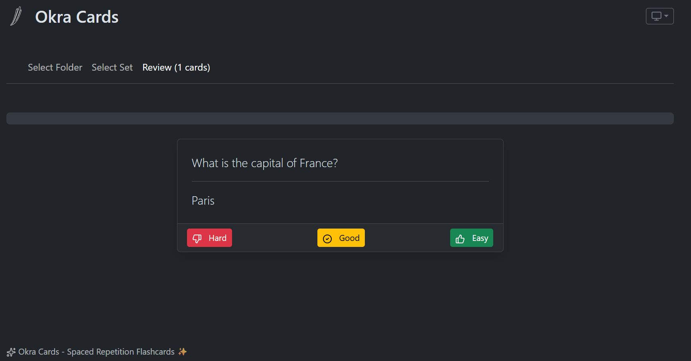

# Okra Cards

**Okra Cards** is an open-source flashcard application that implements spaced repetition algorithms to help you learn and retain information efficiently. Unlike proprietary solutions, Okra Cards works with your local markdown files and doesn't require external dependencies.

Inspired by the [Obsidian Spaced Repetition plugin](https://github.com/st3v3nmw/obsidian-spaced-repetition), Okra Cards provides similar functionality without the need for proprietary software. Although not as feature-rich as the plugin, it offers independence from external tools and can be installed on any system with npm.

Built with React and TypeScript, it offers a clean, intuitive interface for creating and reviewing flashcards from your own content.

## 🚀 Features

- **Local Folder Integration**: Select any folder containing markdown (.md) or text (.txt) files as your flashcard source
- **Multiple Card Formats**: Support for various flashcard formats (basic, reversed, multi-line)
- **Spaced Repetition System**: Implements the proven SM-2 algorithm for optimal review scheduling
- **Multi-Deck Support**: Each markdown file in your folder becomes a separate deck
- **Automatic Detection**: Automatically scans and detects all cards in your selected folder
- **Cross-Platform**: Works on all modern browsers with File System Access API support

## 📷 Screenshots






## 🛠️ Installation & Setup

### Prerequisites
- Node.js (v16 or higher)
- npm or yarn

### Quick Start

1. **Clone the repository**
   ```bash
   git clone https://github.com/your-username/okra-cards.git
   cd okra-cards
   ```

2. **Install dependencies**
   ```bash
   npm install
   ```

3. **Start the development server**
   ```bash
   npm run dev
   ```

4. **Open your browser** to the URL displayed in the terminal (typically `http://localhost:5173`)

## 📝 Flashcard Format

Okra Cards supports multiple flashcard formats in your markdown files:

### Basic Format
```
Front ;; Back
```

### Inverse Format (creates both directions)
```
Front ;;; Back
```

### Multi-line Format
```
? Question
Answer
```

### Multi-line Inverse Format
```
?? Question
Answer
```

## 🎯 How to Use

1. Click on **"Select Cards"** in the navigation menu
2. Click **"Select Flashcard Folder"** to choose a directory containing your markdown/text files
3. The app will automatically scan all `.md` and `.txt` files in the selected directory
4. Click **"Review"** in the navigation menu to start reviewing your flashcards
5. Click **"Show Answer"** to reveal the back of the card
6. Rate your recall using the **"Hard"**, **"Good"**, or **"Easy"** buttons

## 🌐 Browser Compatibility

This application uses the File System Access API, which is available in modern Chromium-based browsers (Chrome, Edge, etc.) version 86 and above. For other browsers, a fallback file selection method is provided.

## 🏗️ Building for Production

To build the application for production:

```bash
npm run build
```

This will create a `dist` directory with the production-ready files that can be served by any static web server.

## ⚙️ Technologies Used

- **React** with TypeScript
- **React Bootstrap** for UI components
- **Vite** as the build tool
- **File System Access API** for local file operations
- **SM-2 algorithm** for spaced repetition
- **Lucide React** icons

## 🤝 Contributing

This is a personal project and I will not be accepting feature requests. However, the MIT license allows you to fork and modify the code as needed.

## 📄 License

This project is open source and available under the MIT License. See the [LICENSE](./LICENSE) file for more details.
